# Tichi Application - Overall Bug Report

**Application:** Tichi - Job Portal Web Application
**URL:** https://tichi-app-webapp-stage.web.app
**Testing Period:** April 27, 2026 - May 6, 2026
**Tester:** QA Team
**Report Date:** May 7, 2026

---

## Executive Summary

This report documents all bugs identified during manual and exploratory testing of the Tichi web application. A total of **20 bugs** have been identified across various modules including Authentication, Profile Management, Job Posting, Subscription Plans, Chat System, and AI Features.

### Bug Summary by Severity

| Severity | Count | Percentage |
|----------|-------|------------|
| Critical | 4     | 20%        |
| High     | 6     | 30%        |
| Medium   | 7     | 35%        |
| Low      | 3     | 15%        |
| **Total**| **20**| **100%**   |

### Bug Summary by Module

| Module | Count |
|--------|-------|
| Authentication & OTP | 3 |
| Profile Management | 2 |
| Job Posting | 3 |
| Subscription Plans | 3 |
| Chat System | 4 |
| AI Features | 2 |
| API/Network | 2 |
| UI/UX | 1 |

---

## Detailed Bug Reports

---

### BUG-001: Blank Page on Application Load

**Bug ID:** BUG-001
**Severity:** Critical
**Priority:** P1
**Module:** Application Core
**Status:** Open
**Reported Date:** April 27, 2026

**Description:**
Application shows a completely blank page (about:blank) when attempting to load, indicating a critical failure in the application initialization.

**Steps to Reproduce:**
1. Open browser
2. Navigate to Tichi application URL
3. Observe blank page

**Expected Result:**
Application should load with the home page or login screen.

**Actual Result:**
Browser displays "about:blank" with no content loaded.

**Screenshot:**
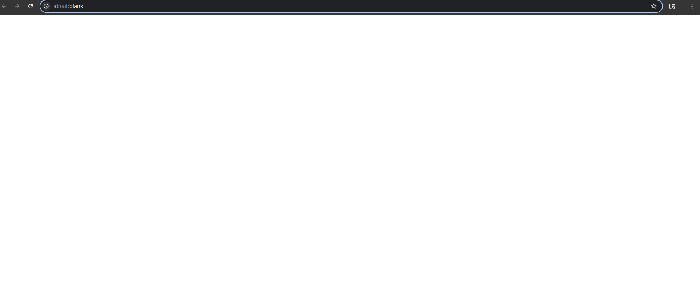

**Impact:**
Users cannot access the application at all, resulting in complete service unavailability.

---

### BUG-002: OTP Verification API Failure (401 Error)

**Bug ID:** BUG-002
**Severity:** Critical
**Priority:** P1
**Module:** Authentication
**Status:** Open
**Reported Date:** April 29, 2026

**Description:**
The send-otp API endpoint returns a 401 Unauthorized error during mobile number verification process, preventing users from completing profile verification.

**Steps to Reproduce:**
1. Login to Tichi application
2. Navigate to Profile settings
3. Attempt to verify mobile number
4. Enter mobile number and request OTP
5. Observe network tab for API response

**Expected Result:**
OTP should be sent successfully to the provided mobile number.

**Actual Result:**
API returns 401 error status. Network request to `https://o0guf45zb8.execute-api.ap-south-1.amazonaws.com/qa/users/send-otp` fails.

**Screenshot:**
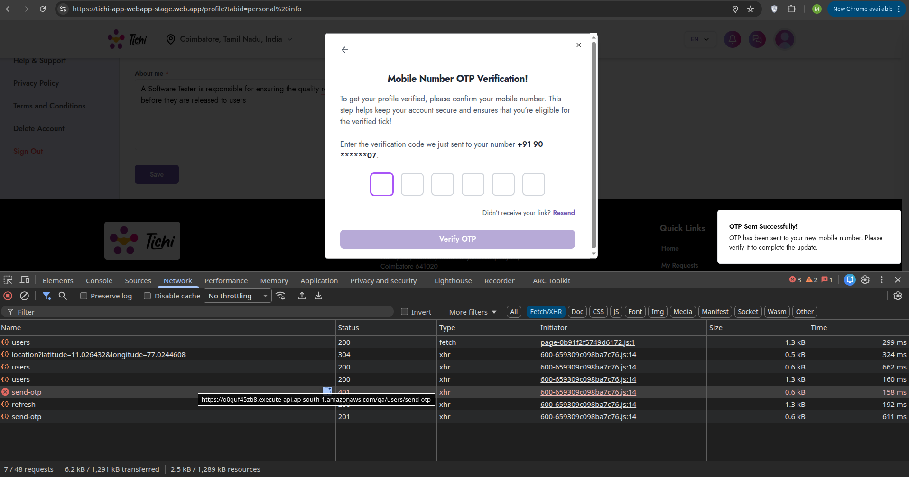

**Technical Details:**
- Endpoint: `/qa/users/send-otp`
- Status Code: 401
- Response Type: XHR

**Impact:**
Users cannot verify their mobile numbers, blocking access to verified profile features.

---

### BUG-003: Verify OTP API Returning 401 Error

**Bug ID:** BUG-003
**Severity:** Critical
**Priority:** P1
**Module:** Authentication
**Status:** Open
**Reported Date:** April 29, 2026

**Description:**
The verify-otp API endpoint returns 401 Unauthorized error when attempting to verify the OTP code.

**Steps to Reproduce:**
1. Request OTP for mobile verification
2. Enter the received OTP code
3. Click "Verify OTP" button
4. Observe network response

**Expected Result:**
OTP should be verified and profile should be marked as verified.

**Actual Result:**
API returns 401 error, verification fails.

**Screenshot:**
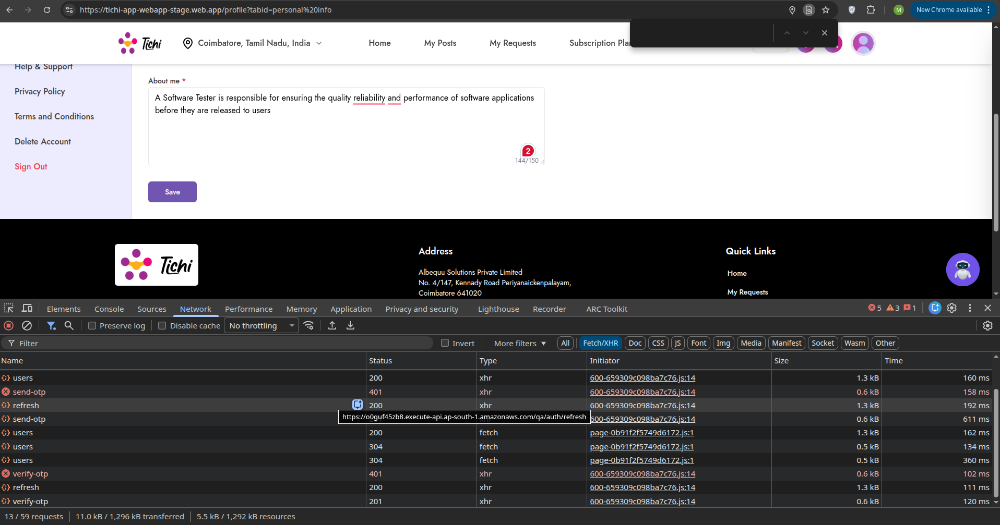

**Impact:**
Users cannot complete the verification process even if they receive the OTP.

---

### BUG-004: AI Generation Service Unavailable

**Bug ID:** BUG-004
**Severity:** High
**Priority:** P2
**Module:** AI Features
**Status:** Open
**Reported Date:** April 29, 2026

**Description:**
The AI Generate feature on the Create New Post page shows "AI Generation Failed - AI service is temporarily unavailable. Please try again later."

**Steps to Reproduce:**
1. Login to Tichi application
2. Navigate to Create New Post page
3. Fill in basic job details (Title, Description)
4. Click "AI Generate" button
5. Observe error message

**Expected Result:**
AI should generate job description content based on the input.

**Actual Result:**
Error toast appears: "AI Generation Failed - AI service is temporarily unavailable. Please try again later."

**Screenshot:**
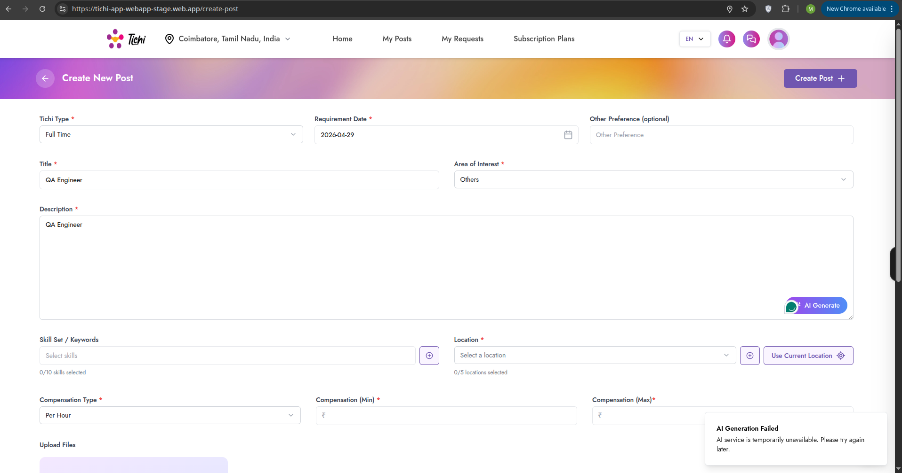

**Impact:**
Users cannot utilize the AI-powered content generation feature, reducing the platform's value proposition.

---

### BUG-005: Description Field Validation Without AI

**Bug ID:** BUG-005
**Severity:** Medium
**Priority:** P3
**Module:** Job Posting
**Status:** Open
**Reported Date:** April 29, 2026

**Description:**
When AI generation fails, the Description field shows validation error "Please fill out this field" but the placeholder text provides misleading guidance about using AI Generate.

**Steps to Reproduce:**
1. Navigate to Create New Post
2. Leave Description empty
3. Attempt to submit
4. Observe validation message

**Expected Result:**
Clear validation message without AI dependency.

**Actual Result:**
Confusing user experience with AI reference when AI is unavailable.

**Screenshot:**
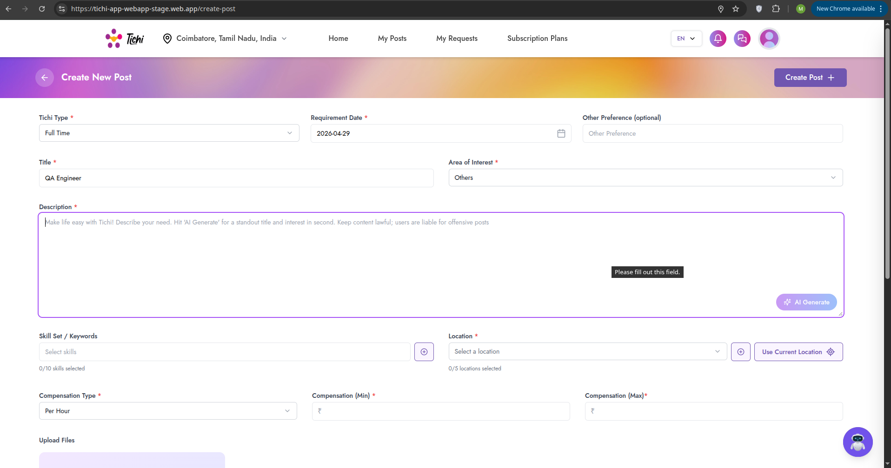

**Impact:**
Poor user experience when AI features are unavailable.

---

### BUG-006: Subscription Plans - "Something Went Wrong" Error

**Bug ID:** BUG-006
**Severity:** High
**Priority:** P2
**Module:** Subscription Plans
**Status:** Open
**Reported Date:** April 29, 2026

**Description:**
When attempting to purchase or interact with subscription plans, a generic error modal appears: "Uh! oh! Something went wrong - We appreciate your patience. While we fix this, continue browsing on tichi-app-webapp-stage.web.app"

**Steps to Reproduce:**
1. Login to Tichi application
2. Navigate to Subscription Plans page
3. Click on any "Buy Now" button
4. Observe error modal

**Expected Result:**
Payment/subscription flow should proceed normally.

**Actual Result:**
Generic error modal appears blocking the transaction.

**Screenshot:**
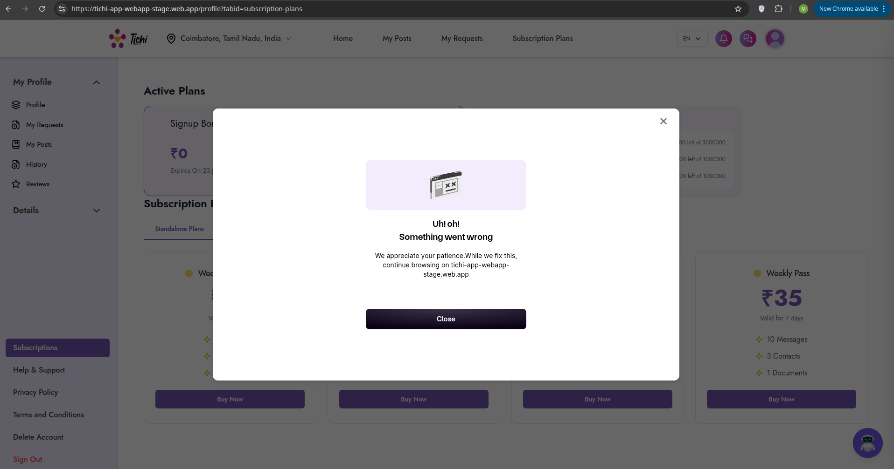

**Impact:**
Users cannot purchase subscription plans, directly affecting revenue.

---

### BUG-007: Subscription Plans Error (Repeated)

**Bug ID:** BUG-007
**Severity:** High
**Priority:** P2
**Module:** Subscription Plans
**Status:** Open
**Reported Date:** May 3, 2026

**Description:**
Same "Something went wrong" error persists on subscription plans page with payment failure message visible.

**Steps to Reproduce:**
1. Navigate to Subscription Plans
2. Attempt any subscription action
3. Observe error

**Expected Result:**
Subscription functionality should work properly.

**Actual Result:**
Error modal with "Payment Failed - Order amount less than minimum amount allowed" message visible.

**Screenshot:**
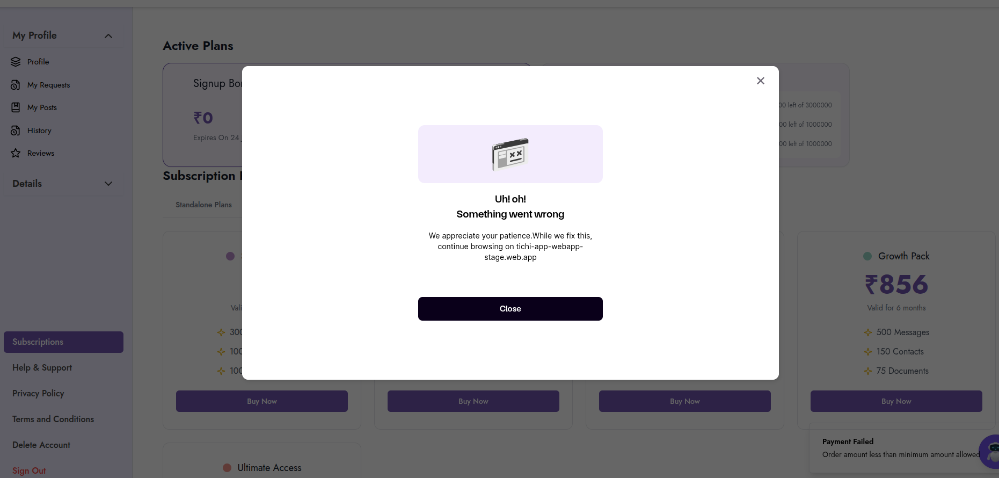

**Impact:**
Continued revenue loss due to broken subscription flow.

---

### BUG-008: Profile Page - Incomplete User Information Display

**Bug ID:** BUG-008
**Severity:** Low
**Priority:** P4
**Module:** Profile Management
**Status:** Open
**Reported Date:** May 3, 2026

**Description:**
Profile page displays user information but the "About me" description appears truncated and the "Get Verified" prompt is always visible regardless of verification status.

**Steps to Reproduce:**
1. Login to Tichi
2. Navigate to Profile page
3. Observe profile information display

**Expected Result:**
Complete profile information displayed with proper verification status.

**Actual Result:**
Truncated about section and persistent verification prompt.

**Screenshot:**
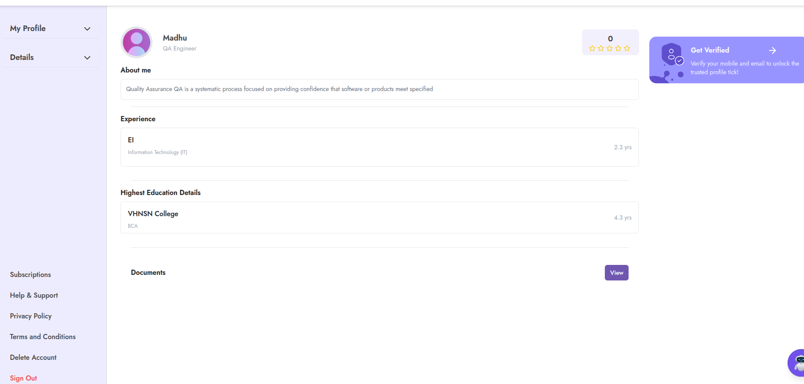

**Impact:**
Minor UX issue affecting profile presentation.

---

### BUG-009: SSL Certificate Information Exposure in Dev Tools

**Bug ID:** BUG-009
**Severity:** Low
**Priority:** P4
**Module:** Security
**Status:** Open
**Reported Date:** May 4, 2026

**Description:**
Certificate viewer shows detailed SSL certificate information which may expose unnecessary technical details.

**Steps to Reproduce:**
1. Open Tichi application
2. Open browser dev tools
3. View Security tab or certificate details
4. Observe certificate hierarchy information

**Expected Result:**
Standard certificate information only.

**Actual Result:**
Detailed certificate fields visible including Certificate Key Usage, Extended Key Usage, etc.

**Screenshot:**
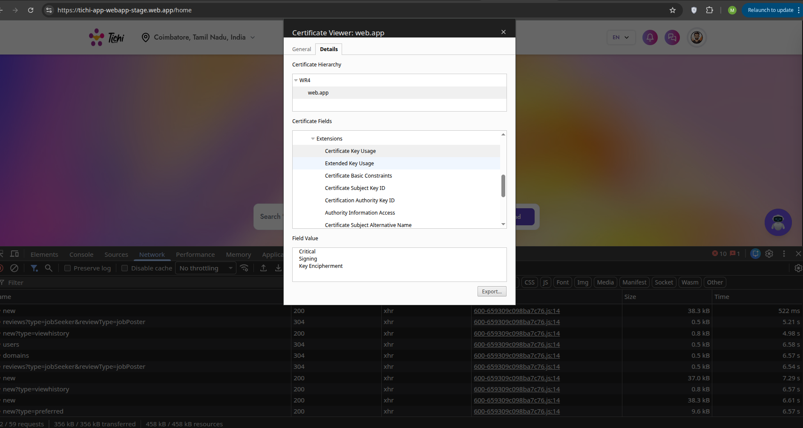

**Impact:**
Minor security information exposure (informational).

---

### BUG-010: Sign Out Confirmation Modal UX Issue

**Bug ID:** BUG-010
**Severity:** Low
**Priority:** P4
**Module:** UI/UX
**Status:** Open
**Reported Date:** May 4, 2026

**Description:**
Sign out confirmation modal appears but the design could be improved for better user experience.

**Steps to Reproduce:**
1. Login to Tichi
2. Click "Sign Out" option
3. Observe confirmation modal

**Expected Result:**
Clean, intuitive sign out confirmation.

**Actual Result:**
Modal functions but design could be improved.

**Screenshot:**
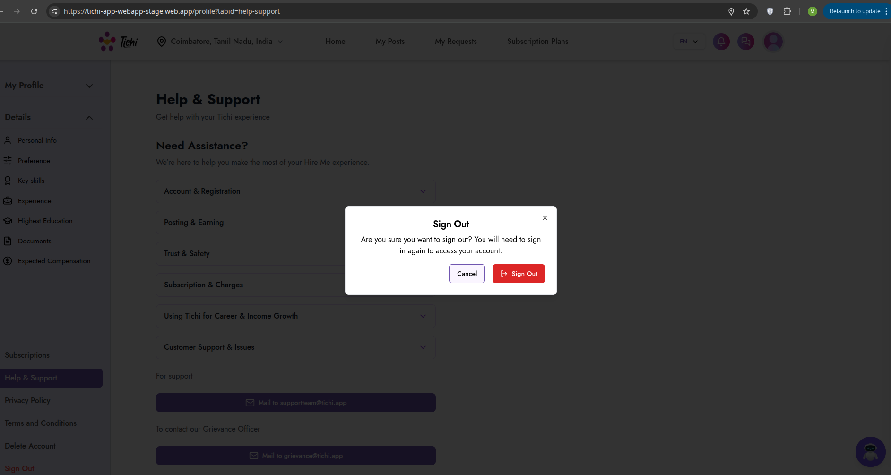

**Impact:**
Minor UX improvement opportunity.

---

### BUG-011: Documents Section - Broken Image Display

**Bug ID:** BUG-011
**Severity:** Medium
**Priority:** P3
**Module:** Profile Management
**Status:** Open
**Reported Date:** May 4, 2026

**Description:**
In the Documents section, uploaded resume shows as broken image placeholder ":Resume" instead of proper document preview or icon.

**Steps to Reproduce:**
1. Login to Tichi
2. Navigate to Profile > Documents
3. Observe uploaded documents display

**Expected Result:**
Documents should display with proper icons or previews.

**Actual Result:**
Broken image placeholder with ":Resume" text visible.

**Screenshot:**
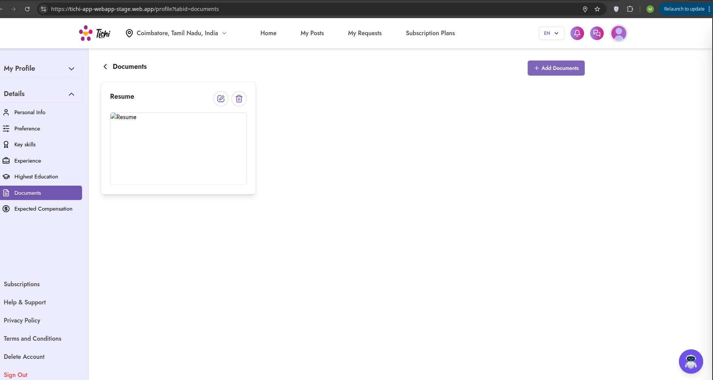

**Impact:**
Users cannot preview their uploaded documents properly.

---

### BUG-012: Tichi Bot - Network Error

**Bug ID:** BUG-012
**Severity:** High
**Priority:** P2
**Module:** Chat System
**Status:** Open
**Reported Date:** May 4, 2026

**Description:**
The Tichi Bot chatbot shows "Network Error" when attempting to interact with it.

**Steps to Reproduce:**
1. Login to Tichi
2. Click on Chat or Tichi Bot icon
3. Type a message (e.g., "Can you Explain me about this job")
4. Observe Network Error response

**Expected Result:**
Bot should respond with helpful information.

**Actual Result:**
"Network Error" message appears in chat.

**Screenshot:**
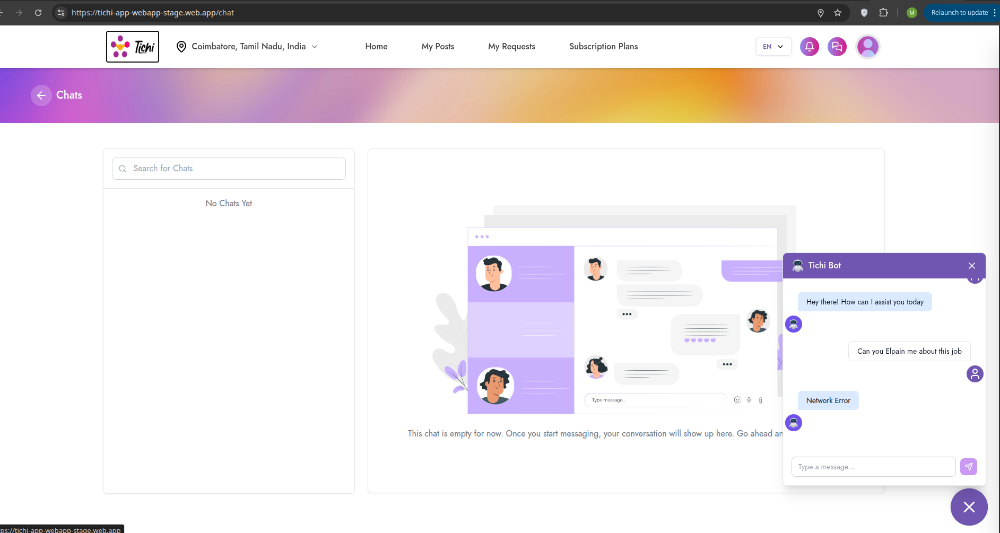

**Impact:**
AI assistant feature completely non-functional.

---

### BUG-013: Login Page - "Something Went Wrong" Error

**Bug ID:** BUG-013
**Severity:** Critical
**Priority:** P1
**Module:** Authentication
**Status:** Open
**Reported Date:** May 4, 2026

**Description:**
Login page displays "Something went wrong. Please try again." error message with console showing ERR_FAILED network errors.

**Steps to Reproduce:**
1. Navigate to Tichi login page
2. Enter email address
3. Click Continue
4. Observe error message

**Expected Result:**
Login flow should proceed to OTP/password entry.

**Actual Result:**
Error message displayed, network requests failing with ERR_FAILED.

**Screenshot:**
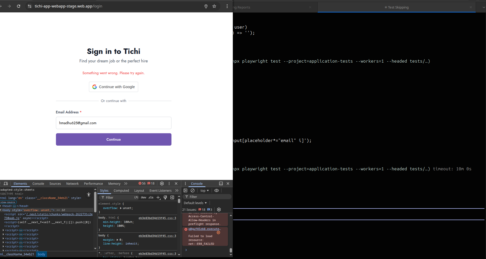

**Technical Details:**
- Console shows: `net::ERR_FAILED`
- Multiple API calls failing
- CORS policy errors visible

**Impact:**
Users cannot login to the application.

---

### BUG-014: Job Post - Title Field Accepts Excessive Gibberish Text

**Bug ID:** BUG-014
**Severity:** Medium
**Priority:** P3
**Module:** Job Posting
**Status:** Open
**Reported Date:** May 5, 2026

**Description:**
Job posting allows creation with nonsensical/gibberish titles without proper validation, resulting in spam-like content visible to all users.

**Steps to Reproduce:**
1. Login to Tichi
2. Create a new job post
3. Enter random characters as title (e.g., "adfadfafadfadfafa...")
4. Submit the post
5. View the published post

**Expected Result:**
Validation should prevent meaningless content or flag for review.

**Actual Result:**
Post created with gibberish title displayed publicly.

**Screenshot:**
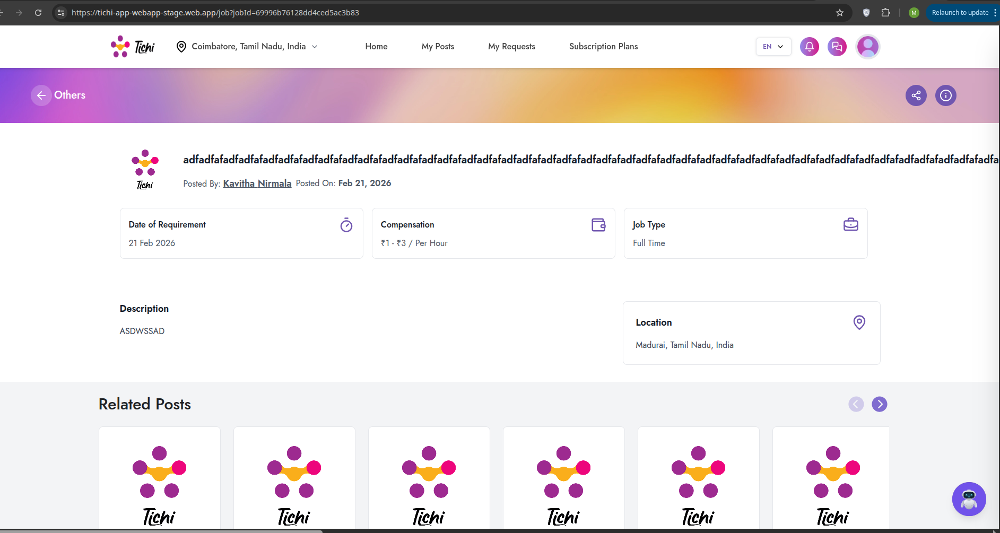

**Impact:**
Poor content quality, potential for spam, degrades platform credibility.

---

### BUG-015: Job Listing - Inconsistent Date Formats

**Bug ID:** BUG-015
**Severity:** Medium
**Priority:** P3
**Module:** Job Posting
**Status:** Open
**Reported Date:** May 5, 2026

**Description:**
Job listings show dates in different formats (some show "Feb 12, 2026" while others show different formats), creating inconsistent user experience.

**Steps to Reproduce:**
1. Navigate to Job listings page
2. Compare date formats across different listings
3. Observe inconsistencies

**Expected Result:**
All dates should follow consistent format.

**Actual Result:**
Mixed date formats across listings.

**Screenshot:**
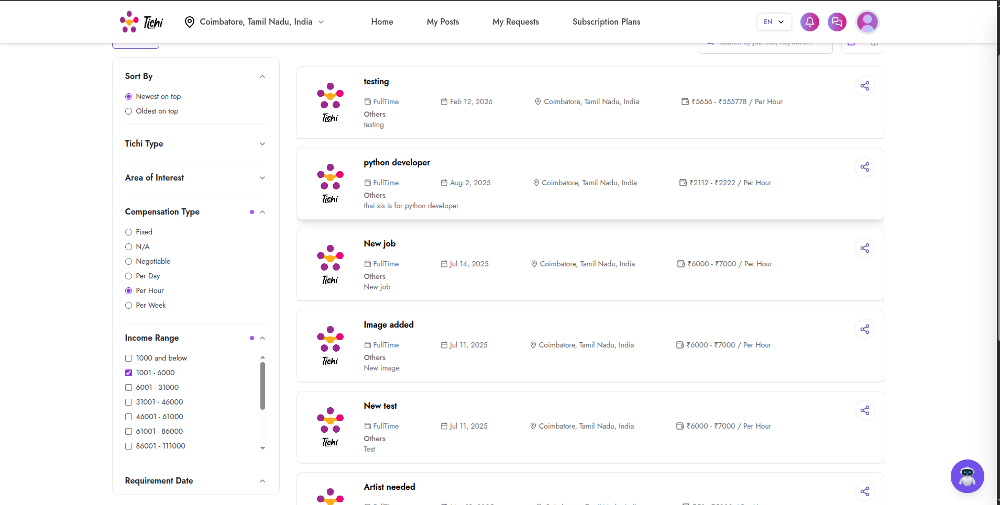

**Impact:**
Minor UX issue but affects professional appearance.

---

### BUG-016: Create Post - Date Picker Format Issue

**Bug ID:** BUG-016
**Severity:** Medium
**Priority:** P3
**Module:** Job Posting
**Status:** Open
**Reported Date:** May 5, 2026

**Description:**
Date picker on Create New Post shows placeholder "dd-mm-yyyy" format but actual selected date shows different format (2026-05-05).

**Steps to Reproduce:**
1. Navigate to Create New Post
2. Click on Requirement Date field
3. Select a date
4. Observe format mismatch

**Expected Result:**
Consistent date format throughout.

**Actual Result:**
Placeholder shows "dd-mm-yyyy" but selected value shows "yyyy-mm-dd".

**Screenshots:**
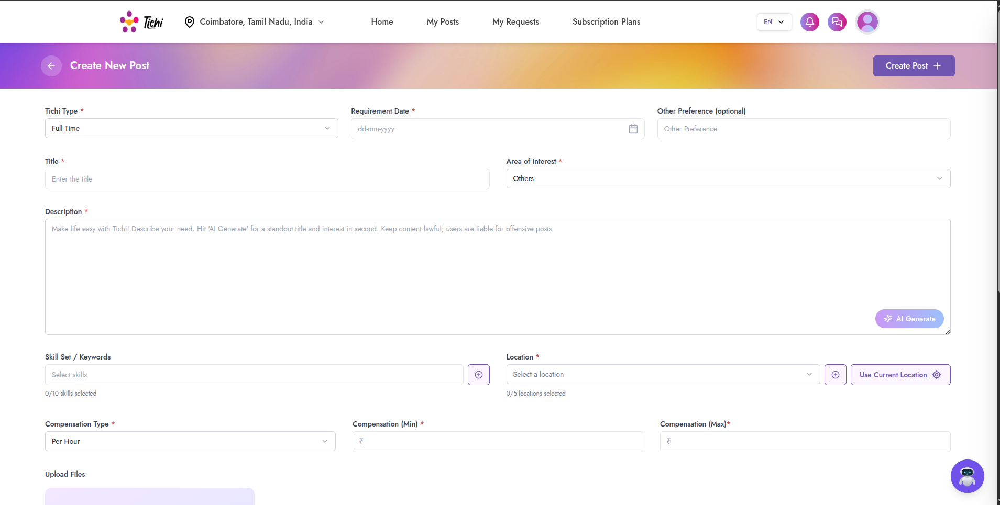
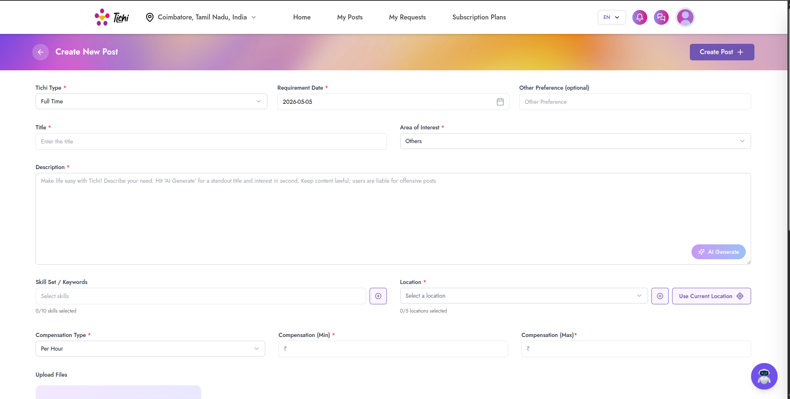

**Impact:**
User confusion about expected date format.

---

### BUG-017: Chat Connection Error - Failed to Connect to Chat Server

**Bug ID:** BUG-017
**Severity:** High
**Priority:** P2
**Module:** Chat System
**Status:** Open
**Reported Date:** May 6, 2026

**Description:**
Chat feature shows "Connection Error - Failed to connect to chat server. Please check your internet connection and try again." even with stable internet connection.

**Steps to Reproduce:**
1. Login to Tichi
2. Navigate to Chats section
3. Select a contact (e.g., "Allwin Martin")
4. Observe connection error

**Expected Result:**
Chat should connect and allow messaging.

**Actual Result:**
Connection Error popup appears, chat shows "Connecting..." status indefinitely.

**Screenshots:**


**Impact:**
Users cannot communicate through the platform's chat feature.

---

### BUG-018: My Requests - CORS Policy Error & No Posts Found

**Bug ID:** BUG-018
**Severity:** High
**Priority:** P2
**Module:** API/Network
**Status:** Open
**Reported Date:** May 6, 2026

**Description:**
My Requests page shows "No posts found" with multiple CORS policy errors in console. The API requests are being blocked due to missing Access-Control-Allow-Headers.

**Steps to Reproduce:**
1. Login to Tichi
2. Navigate to My Requests
3. Open browser console
4. Observe CORS errors

**Expected Result:**
User's requests should be displayed properly.

**Actual Result:**
"No posts found" message with CORS errors:
- `Access-Control-Allow-Headers in preflight response`
- `net::ERR_FAILED` errors

**Screenshot:**
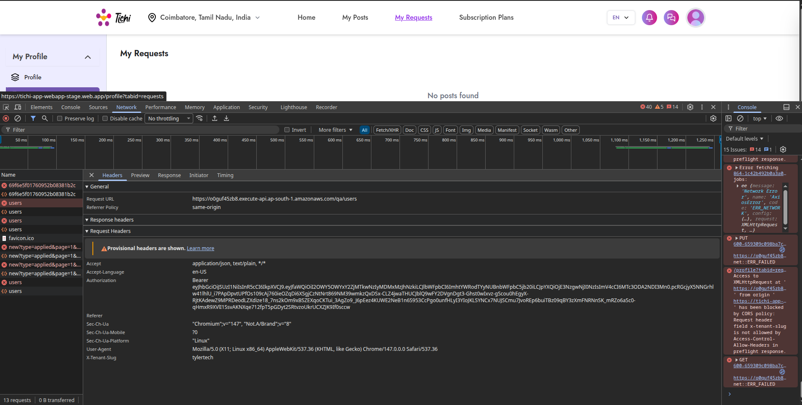

**Technical Details:**
- Request header `x-tenant-slug` is not allowed by Access-Control-Allow-Headers in preflight response
- Multiple API endpoints affected

**Impact:**
Critical functionality broken, users cannot view their requests.

---

### BUG-019: Chat Connection Error (Different User)

**Bug ID:** BUG-019
**Severity:** High
**Priority:** P2
**Module:** Chat System
**Status:** Open
**Reported Date:** May 6, 2026

**Description:**
Chat connection error persists when trying to chat with different users (Paramesh), indicating a systemic issue with the chat service.

**Steps to Reproduce:**
1. Navigate to Chats
2. Select different user "Paramesh"
3. Try to send message "hi"
4. Observe connection error

**Expected Result:**
Chat should connect successfully.

**Actual Result:**
Same "Connection Error - Failed to connect to chat server" message appears.

**Screenshot:**
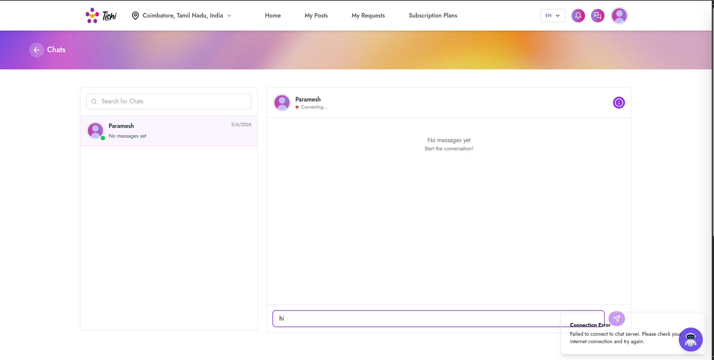

**Impact:**
Complete chat functionality failure across all users.

---

### BUG-020: Profile Incomplete Notification Overlaps UI

**Bug ID:** BUG-020
**Severity:** Medium
**Priority:** P3
**Module:** UI/UX
**Status:** Open
**Reported Date:** April 29, 2026

**Description:**
The "Profile Incomplete" notification popup overlaps with other UI elements and the chat bot icon, creating visual clutter.

**Steps to Reproduce:**
1. Login with incomplete profile
2. Navigate to any page
3. Observe notification popup position

**Expected Result:**
Notification should be positioned without overlapping other elements.

**Actual Result:**
Notification overlaps with chat bot icon.

**Screenshot:**
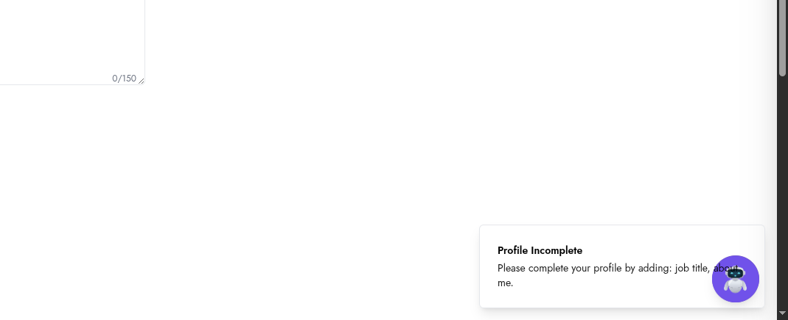

**Impact:**
Minor UI/UX issue affecting visual presentation.

---

## Bug Distribution Analysis

### By Priority

```
P1 (Critical): ████████████████ 4 bugs (20%)
P2 (High):     ████████████████████████ 6 bugs (30%)
P3 (Medium):   ████████████████████████████ 7 bugs (35%)
P4 (Low):      ████████████ 3 bugs (15%)
```

### By Status

| Status | Count |
|--------|-------|
| Open   | 20    |
| In Progress | 0 |
| Resolved | 0 |
| Closed | 0 |

---

## Recommendations

### Immediate Actions (P1 - Critical)
1. **Fix Authentication APIs** - OTP send/verify endpoints returning 401 errors
2. **Resolve Login Issues** - Network errors blocking user access
3. **Fix Application Load** - Blank page on initial load

### Short-term Actions (P2 - High)
1. **Fix Chat Server Connection** - WebSocket/Socket connection issues
2. **Resolve CORS Configuration** - Add missing headers to API responses
3. **Fix AI Service** - Restore AI generation functionality
4. **Fix Subscription Flow** - Payment integration issues

### Medium-term Actions (P3 - Medium)
1. **Input Validation** - Add proper content validation for job posts
2. **Date Format Standardization** - Consistent date formats across the application
3. **Document Preview** - Fix broken image displays
4. **UI Polish** - Fix overlapping elements

### Long-term Actions (P4 - Low)
1. **UX Improvements** - Modal designs, notifications
2. **Security Hardening** - Certificate information exposure

---

## Test Environment

| Parameter | Value |
|-----------|-------|
| Browser | Chrome 147.0.0.0 |
| OS | Linux |
| Application URL | https://tichi-app-webapp-stage.web.app |
| Environment | Staging (QA) |
| API Endpoint | https://o0guf45zb8.execute-api.ap-south-1.amazonaws.com/qa |

---

## Appendix: Screenshot Reference

| Bug ID | Screenshot File |
|--------|-----------------|
| BUG-001 | BUG_2026_04_27_10_43_35.png |
| BUG-002 | BUG_2026_04_29_16_13_31.png |
| BUG-003 | BUG_2026_04_29_16_14_18.png |
| BUG-004 | BUG_2026_04_29_16_42_17.png |
| BUG-005 | BUG_2026_04_29_16_42_53.png |
| BUG-006 | BUG_2026_04_29_18_18_18.png |
| BUG-007 | BUG_2026_05_03_18_01_14.png |
| BUG-008 | BUG_2026_05_03_18_06_27.png |
| BUG-009 | BUG_2026_05_04_10_58_25.png |
| BUG-010 | BUG_2026_05_04_11_54_16.png |
| BUG-011 | BUG_2026_05_04_12_00_59.png |
| BUG-012 | BUG_2026_05_04_12_10_46.png |
| BUG-013 | BUG_2026_05_04_17_47_29.png |
| BUG-014 | BUG_2026_05_05_12_24_44.png |
| BUG-015 | BUG_2026_05_05_12_52_44.png |
| BUG-016 | BUG_2026_05_05_17_49_59.png, BUG_2026_05_05_17_50_18.png |
| BUG-017 | BUG_2026_05_06_14_11_49.png, BUG_2026_05_06_14_12_07.png |
| BUG-018 | BUG_2026_05_06_16_16_53.png |
| BUG-019 | BUG_2026_05_06_17_49_52.png |
| BUG-020 | BUG_2026_04_29_14_25_38.png |

---

**Report Prepared By:** QA Team
**Report Version:** 1.0
**Last Updated:** May 7, 2026
